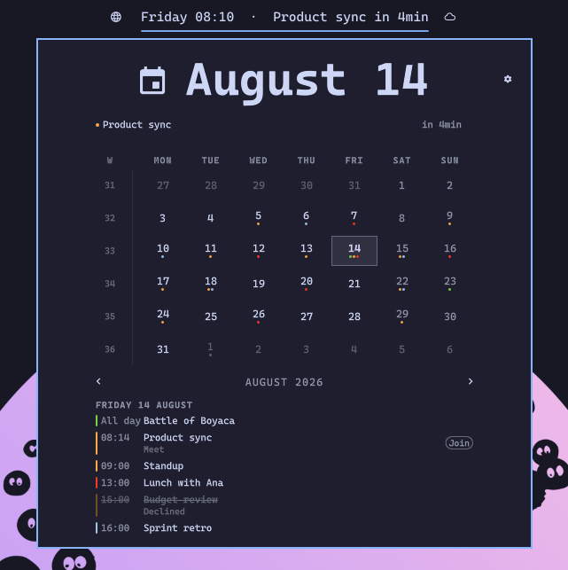
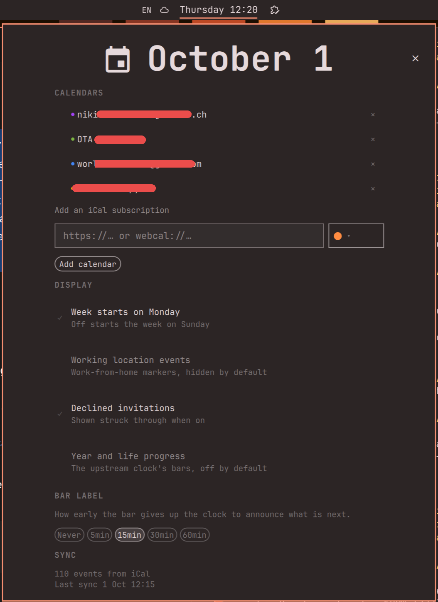

# Easy Calendar for Omarchy

**Your iCal calendars in the Omarchy bar.** A month view with real events and
the next meeting announced directly in the clock label.

This project started as a fork of
[tmn73/omarchy-calendar](https://github.com/tmn73/omarchy-calendar), but has
since evolved into a standalone plugin focused on simple calendar integration.



## Features

- Month grid with ISO week numbers and coloured dots per calendar
- Selected-day agenda and live next-event countdown
- Join button for events with a video link
- Per-calendar visibility and automatic calendar names from iCal metadata
- Week start, declined-event and working-location display settings
- The original Omarchy clock formats and optional year/life progress bars
- HTTPS and `webcal://` subscriptions with recurring events, exceptions,
  timezones and all-day events

The plugin supports iCal subscriptions only. Calendars are added and removed
from the settings panel; there is no Google CLI, OAuth setup or alternate
source-management tool.

## Install

```bash
omarchy plugin add https://github.com/itcaat/omarchy-calendar.git --enable
```

This widget replaces the built-in clock. In
`~/.config/omarchy/shell.json`, remove `omarchy.clock` from
`bar.layout.center` and configure:

```json
{
  "bar": {
    "centerAnchor": "itcaat.calendar",
    "layout": {
      "center": [
        { "id": "itcaat.calendar", "format": "dddd HH:mm" }
      ]
    }
  }
}
```

Then reload the shell:

```bash
omarchy restart shell
```

## Add calendars

Open the calendar, click the gear, paste an HTTPS or `webcal://` subscription
URL and click **Add calendar**. The first addition automatically creates the
private Python environment, installs the iCal dependencies and enables the
five-minute sync timer. Nothing needs to be run in a terminal first.

Before adding a calendar, choose one of the nine available calendar colors.
The selected color is saved with the subscription and used for its event dots.

The calendar name is read from `X-WR-CALNAME` or `NAME` in the feed. Its color
is read from `X-APPLE-CALENDAR-COLOR` or `COLOR`. If either value is missing,
the hostname or a default color is used. The settings panel also lets you hide
or remove calendars.



For Google Calendar, use **Settings > your calendar > Integrate calendar >
Secret address in iCal format**. The same kind of subscription link works with
other calendar providers.

Private URLs are stored only in `~/.config/omarchy/calendar-sync.json`, with
permissions `600`. They are never written to the events file or error output.

## Local development

To use a local checkout instead of a copied plugin, run:

```bash
make install
```

The equivalent commands are:

```bash
omarchy plugin validate /home/itcat/Work/itcaat/omarchy-calendar
mkdir -p ~/.config/omarchy/plugins
ln -s /home/itcat/Work/itcaat/omarchy-calendar \
  ~/.config/omarchy/plugins/itcaat.calendar
omarchy-shell shell rescanPlugins
omarchy plugin enable itcaat.calendar
```

This removes the current installation, validates the checkout, creates the
local symlink, rescans plugins, waits until Omarchy discovers it and enables
`itcaat.calendar`. This makes it safe to use while iterating on the plugin.
The individual steps are also available as `make validate`, `make link`,
`make rescan`, `make enable` and `make remove`.

Verify that local development is active with:

```bash
readlink ~/.config/omarchy/plugins/itcaat.calendar
```

It should print the path to this checkout, not a copied directory.

If `itcaat.calendar` is already installed as a copied plugin, remove that copy
first with `omarchy plugin remove itcaat.calendar --yes`. Changes in the local
checkout are then picked up automatically; restart the shell if needed:

```bash
omarchy restart shell
```

## Configuration

The sync configuration is maintained by the settings panel. It has this
shape; feed names may be omitted because they are discovered automatically:

```json
{
  "ical": {
    "feeds": [
      {
        "id": "ical-personal",
        "color": "#4285f4",
        "url": "https://example.com/private-calendar.ics"
      }
    ]
  },
  "window": { "pastDays": 7, "futureDays": 60 }
}
```

Keep each feed ID unique and stable. The sync writes events atomically to
`~/.local/state/omarchy/calendar-events.json`. An invalid or unavailable feed
leaves the previous events file intact.

The event contract supports these optional fields:

| Field | Effect |
|---|---|
| `meetingUrl` | Shows the **Join** button around the event time; HTTPS only |
| `eventUrl` | Opens the event when its row is clicked; HTTPS only |
| `eventType` | `workingLocation` is hidden by default, `outOfOffice` is labelled |
| `responseStatus` | `declined` is struck through or hidden by the setting |

## Troubleshooting

```bash
journalctl --user -u omarchy-calendar-sync -f
systemctl --user list-timers omarchy-calendar-sync.timer
```

| Symptom | Cause |
|---|---|
| No calendars appear | Open Settings and add an HTTPS or `webcal://` subscription |
| The panel says the calendar may be out of date | Check the sync journal above |
| Events are off by a day | Check the feed timezone and report the feed format if it is valid |
| The Join button never appears | It is shown only around the event time and for HTTPS meeting links |

## Uninstall

```bash
systemctl --user disable --now omarchy-calendar-sync.timer
rm ~/.config/systemd/user/omarchy-calendar-sync.{service,timer}
systemctl --user daemon-reload
omarchy plugin remove itcaat.calendar
```

For iCal, subscriptions remain in
`~/.config/omarchy/calendar-sync.json`; remove that file if you also want to
forget the feed URLs. The Python environment remains in
`${XDG_DATA_HOME:-~/.local/share}/omarchy-calendar/venv` and can be removed
separately.
